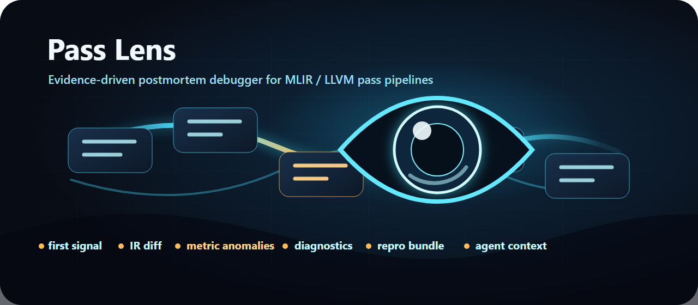
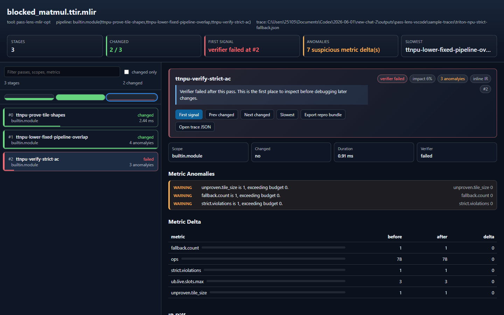
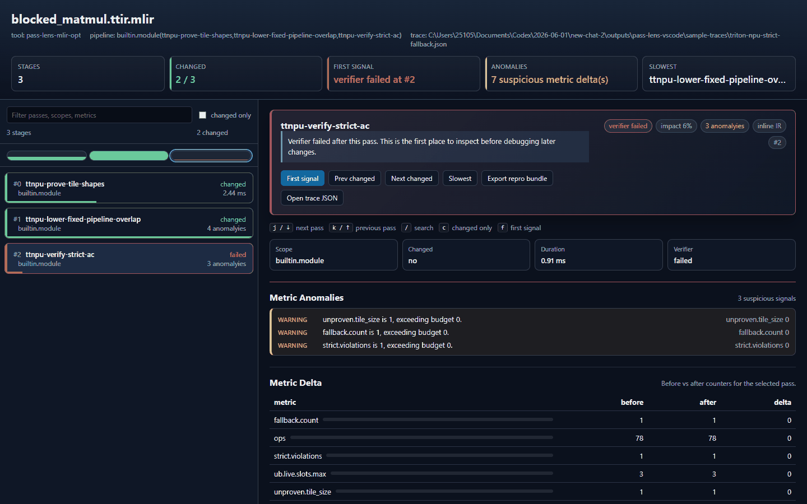

<p align="center">
  
</p>

<h1 align="center">Pass Lens</h1>

<p align="center">
  <strong>Evidence-driven postmortem debugger for MLIR / LLVM pass pipelines.</strong>
</p>

<p align="center">
  Turn compiler pass traces into a focused investigation: first signal, IR diff,
  diagnostics, metric anomalies, trace quality, repro context, and artifact paths.
</p>

<p align="center">
  <a href="README.zh-CN.md">中文</a>
  ·
  <a href="docs/trace-schema.md">Trace Schema</a>
  ·
  <a href="docs/collector-author-guide.md">Collector Guide</a>
  ·
  <a href="docs/sample-provenance.md">Sample Provenance</a>
  ·
  <a href="docs/release-milestones.md">Milestones</a>
  ·
  <a href="collectors/mlir-pass-lens">MLIR Collector</a>
</p>

<p align="center">
  <a href="https://github.com/2510551378/PassLens/actions/workflows/ci.yml"></a>
  
  
  
  
</p>





## Why Pass Lens

Compiler failures are rarely born at the final crash. Invalid IR, legality
breakage, resource-budget overflow, or suspicious metric jumps often appear
several passes earlier.

Pass Lens gives compiler engineers a trace-grounded workflow:

| Step | What Pass Lens surfaces |
| --- | --- |
| Signal | First verifier failure, first IR change, first anomaly, slowest pass |
| Evidence | Before/after IR, diagnostics, metric deltas, validation issues |
| Repro | Markdown repro, directory repro bundle, commands, artifacts |
| Agent handoff | Bounded JSON/Markdown context with evidence IDs and guardrails |

The Pass Lens trace schema is the public contract. The VS Code extension is one
viewer, the MLIR collector is one reference producer, and downstream compilers
can implement their own producers.

## Highlights

- Pass-by-pass timeline with changed, unchanged, failed, anomalous, and slow
  stages.
- Virtualized timeline rendering for long pass pipelines.
- First-signal navigation for verifier failures, first IR changes, anomaly
  spikes, and slowest passes.
- Side-by-side IR diff with inline snapshots or lazy-loaded artifact-backed IR.
- Metric anomaly detection for zero-to-positive jumps, large relative changes,
  and domain-specific budget violations.
- Trace quality score for collector credibility: pass identity, timing,
  verifier status, artifact coverage, and index consistency.
- Trace size report with quick fixes for traces that should switch from inline
  IR to artifact-backed capture.
- Directory-style repro bundle with `trace.json`, artifacts, diagnostics,
  `run.ps1`, `run.sh`, `manifest.json`, agent context, and an agent tool
  manifest.
- Deterministic issue summaries and suspicious-pass explanations before any
  model call.
- Trace-grounded AI exports: cited evidence and bounded context, not a generic
  chat surface.
- Agent-ready deterministic tool contracts for queries, reports, exports, and
  local rerun/bisect workflows.
- Preview natural-language query planning maps clear requests to deterministic
  Pass Lens tools instead of opening a generic chat surface.
- MLIR support through both `mlir-opt` dump fallback and structured
  `PassInstrumentation` collection.

## Quick Start

Download `pass-lens-0.1.0.vsix` from the
[v0.1.0 release](https://github.com/2510551378/PassLens/releases/tag/v0.1.0),
or build it locally:

```powershell
npm install
npm run package
code --install-extension pass-lens-0.1.0.vsix
```



Open VS Code and run `Pass Lens: Open Sample Trace`.

Good first samples:

- `Live MLIR PassInstrumentation`: real structured collector output with
  artifact-backed IR.
- `Verifier failure`: opens on the first failed pass.
- `External IR artifacts`: demonstrates lazy artifact-backed IR loading.
- `Toy MLIR pipeline`: smallest end-to-end viewer smoke test.
- `Long lowering pipeline`: useful for filtering, navigation, and slow-pass UX.
- `Live IREE lowering (PassInstrumentation)`: redacted real downstream
  structured sample from L20 with artifact-backed stages.

Open your own trace with `Pass Lens: Open Trace File`. The trace should follow
[`docs/pass-lens.schema.json`](docs/pass-lens.schema.json).

Validate a trace before sharing or uploading it from CI:

```powershell
npm run validate:trace -- --check-artifacts path\to\trace.json
```

Before preparing a public preview build, run the full release smoke sequence:

```powershell
npm run release:smoke
```

Then publish with an explicit target (default is dry-run):

```powershell
npm run release:publish:marketplace      # dry-run preview plan
npm run release:publish:marketplace -- --execute   # real publish
npm run release:publish:open-vsx          # dry-run preview plan
npm run release:publish:open-vsx -- --execute      # real publish
```

You can also run the release plan preview to review both target plans in one
JSON payload before publish:

```powershell
npm run release:preview:plan -- --json
npm run release:preview:plan -- --output .github/release-preview-plan.json
```

See [`docs/release-readiness.md`](docs/release-readiness.md) for the
Marketplace / Open VSX checklist.

### Real Data Validation Checklist

Pass Lens should also work on real compiler traces, not only bundled fixtures.
Use these checks to validate end-to-end evidence capture on your machine:

```powershell
# 1) Open-source LLVM MLIR cases (structured collector + artifact-backed IR)
npm run smoke:oss-mlir

# 2) Real downstream integration, when a driver is available
npm run smoke:heir-case-study
npm run smoke:iree-case-study
npm run smoke:torch-mlir-case-study
npm run smoke:downstream-case-studies
```

Required environment variables:

- `PASS_LENS_MLIR_OPT` (or `PASS_LENS_MLIR_DRIVER`) for `smoke:oss-mlir`
- `PASS_LENS_OSS_SOURCE_ROOT` to reuse local llvm mlir test files (optional)
- `PASS_LENS_IREE_DRIVER` / `PASS_LENS_TORCH_MLIR_DRIVER` for downstream
  scripts
- `PASS_LENS_HEIR_ROOT` for `smoke:heir-case-study`
- `PASS_LENS_IREE_CASE_DIR` and `PASS_LENS_TORCH_MLIR_CASE_DIR` to control output
  directories

Acceptance criteria for a successful smoke run:

- trace files validate with `npm run validate:trace -- --strict-only ...`
- no error summary entries for stage count, schema, or artifact references
- `provenance.kind` matches expected source:
  - `live-pass-instrumentation` for structured collector runs
  - `converted-dump` for fallback or textual-imported samples
- summary JSON in the case output directory has:
  - `stageCount >= 1`
  - `errors.length === 0`

Hands-on guides:

- [`docs/first-bad-pass-workflow.md`](docs/first-bad-pass-workflow.md)
- [`docs/mlir-discourse-post-draft.md`](docs/mlir-discourse-post-draft.md)
- [`docs/from-ir-dumps-to-observability.md`](docs/from-ir-dumps-to-observability.md)

## Usage Guide

### 1. Inspect a Trace

Start with a sample or a local JSON trace:

```text
Pass Lens: Open Sample Trace
Pass Lens: Open Trace File
```

Read the top summary cards first:

- `First signal`: first verifier failure, or first changed pass if no failure
  exists.
- `Anomalies`: suspicious metric jumps or budget violations.
- `Trace quality`: whether the collector provided pass identity, timing,
  verifier status, artifacts, and stable stage indexes.
- `Trace size`: inline IR bytes, artifact bytes, diagnostics bytes, and quick
  fixes for traces that should switch to artifact-backed capture.
- `Origin`: whether the trace is live instrumentation, a converted dump,
  hand-authored, or a real artifact capture.

Select a pass in the timeline to inspect:

- before/after IR diff;
- metric deltas;
- diagnostics;
- artifact paths;
- suspicious-pass explanation;
- copy/export actions.

Artifact-backed IR is loaded lazily. Opening a large trace does not read every
before/after artifact; Pass Lens reads artifact text for the selected stage when
you inspect or export it.

### 2. Collect a Structured MLIR Trace

Use this path when you can build `pass-lens-mlir-opt` or integrate the collector
into a downstream MLIR driver:

```powershell
pass-lens-mlir-opt input.mlir `
  --pass-pipeline="builtin.module(func.func(canonicalize,cse))" `
  --pass-lens-trace=input.pass-lens.json `
  --pass-lens-artifact-dir=input.pass-lens-artifacts `
  -o output.mlir
```

Then open `input.pass-lens.json` with `Pass Lens: Open Trace File`.

This is the preferred path for:

- pass identity and nested pass scope;
- verifier attribution;
- per-pass timing;
- metric capture;
- artifact-backed before/after IR.

### 3. Use the `mlir-opt` Dump Fallback

When only `mlir-opt` is available, run:

```text
Pass Lens: Run mlir-opt Trace
```

This wrapper reverse-parses textual dump markers from `mlir-opt`. It is useful
for quick experiments, but it cannot provide reliable per-pass duration. Pass
Lens labels this limitation through trace quality reports instead of pretending
the fallback is equivalent to structured instrumentation.

### 4. Emit JSON From Another Compiler

Downstream compilers can emit the schema directly. For real compiler pipelines,
prefer artifact-backed IR:

```json
{
  "schemaVersion": 1,
  "tool": "my-compiler",
  "provenance": {
    "kind": "live-pass-instrumentation",
    "description": "Collected from the compiler pass instrumentation hook."
  },
  "capture": {
    "ir": "artifact",
    "metrics": true,
    "timing": true
  },
  "stages": [
    {
      "index": 0,
      "pass": "my-pass",
      "status": "changed",
      "changed": true,
      "artifacts": {
        "beforePath": "artifacts/0-before.mlir",
        "afterPath": "artifacts/0-after.mlir",
        "diagnosticsPath": "artifacts/0-diag.txt"
      },
      "metricsBefore": {
        "ops": 10
      },
      "metricsAfter": {
        "ops": 7
      }
    }
  ]
}
```

Use [`docs/schema-examples.md`](docs/schema-examples.md) as collector-author
templates for MLIR, LLVM New Pass Manager-style traces, and hardware backend
metrics. The full schema lives at
[`docs/pass-lens.schema.json`](docs/pass-lens.schema.json), and field semantics
are documented in [`docs/trace-schema.md`](docs/trace-schema.md). For a
step-by-step producer integration path, see
[`docs/collector-author-guide.md`](docs/collector-author-guide.md). MLIR driver
authors can use the small C++ SDK surface documented in
[`docs/mlir-collector-sdk.md`](docs/mlir-collector-sdk.md).

### 5. Run a Downstream Structured Case Study

For real compiler pipelines that already support Pass Lens flags, use a downstream
smoke runner.

IREE:

```powershell
$env:PASS_LENS_IREE_DRIVER="/path/to/downstream-driver"
npm run smoke:iree-case-study
```

Torch-MLIR:

```powershell
$env:PASS_LENS_TORCH_MLIR_DRIVER="/path/to/downstream-driver"
npm run smoke:torch-mlir-case-study
```

Or run both available downstream structured case studies in one shot:

```powershell
$env:PASS_LENS_IREE_DRIVER="/path/to/iree-driver"
$env:PASS_LENS_TORCH_MLIR_DRIVER="/path/to/torch-mlir-driver"
npm run smoke:downstream-case-studies
```

The runner validates:

- zero driver exit code;
- strict schema validation;
- viewer validation;
- artifact path existence checks (when enabled);
- provenance kind (`live-pass-instrumentation`).

Once a trace is validated, you can promote it into the local sample set:

```bash
npm run promote:downstream-sample -- \
  --source .pass-lens-iree-case-study/iree-downstream-lowering.trace.json \
  --sample-name iree-structured-downstream \
  --sample-dir sample-traces \
  --redact-input --redact-command
```

This helper validates the same strict/viewer contract and, by default, copies
referenced artifacts into `sample-traces/` (override with `--no-copy-artifacts`).

If your compiler needs extra flags, pass them with `--driver-arg`:

```bash
npm run compile
node scripts/iree-case-study-smoke.js \
  --driver /path/to/downstream-driver \
  --input /path/to/input.mlir \
  --driver-arg --my-driver-extra-flag \
  --driver-arg --other-extra-flag
```

Torch-MLIR equivalent:

```bash
node scripts/torch-mlir-case-study-smoke.js \
  --driver /path/to/downstream-driver \
  --input /path/to/input.mlir \
  --pipeline builtin.module(func.func(canonicalize,cse)) \
  --driver-arg --my-driver-extra-flag
```

### 6. Generate Reports and Repro Artifacts

After opening a trace, run:

```text
Pass Lens: Query Current Trace
```

Useful report actions include:

- GitHub issue description;
- top suspicious passes;
- first fallback / legality / budget signal;
- candidate root causes;
- trace quality report;
- trace size report.

From the trace panel you can also export:

- Markdown repro bundle;
- directory repro bundle with `trace.json`, artifacts, `run.ps1`, `run.sh`,
  `manifest.json`, `agent-context.json`, and `agent-tools.json`;
- bounded agent context as JSON or Markdown;
- suspicious-pass explanation.

Agent exports follow
[`docs/pass-lens-agent-context.schema.json`](docs/pass-lens-agent-context.schema.json).
Agent tool manifests follow
[`docs/pass-lens-agent-tools.schema.json`](docs/pass-lens-agent-tools.schema.json).
See [`docs/agent-tools.md`](docs/agent-tools.md) for the agent-facing contract.

### 7. Find a Minimal Failing Prefix

If a pipeline fails and you need the smallest failing prefix, run:

```text
Pass Lens: Run Prefix Bisect
```

Pass Lens reruns textual MLIR pipeline prefixes with the configured structured
collector driver and opens a minimal failing prefix report with command lines,
attempt traces, diagnostics, and the shortest failing prefix if one is found.

### 8. Work With Large Traces

For real compiler pipelines:

- prefer `capture.ir = "artifact"` over large inline IR strings;
- keep before/after IR in sidecar files and reference them through
  `artifacts.beforePath` / `artifacts.afterPath`;
- include `provenance` so users know whether a trace came from live
  instrumentation, converted dumps, hand-authored examples, or real artifact
  captures;
- use the trace size report to find inline payloads that should move to
  artifacts;
- use trace quality reports before trusting root-cause candidates.

## Keyboard Shortcuts

| Shortcut | Action |
| --- | --- |
| `j` / `Down` | Next visible pass |
| `k` / `Up` | Previous visible pass |
| `/` | Focus search |
| `c` | Toggle changed-only |
| `f` | Jump to first signal |
| `a` | Jump to first anomaly |
| `s` | Jump to slowest pass |

## Sample Gallery

`Pass Lens: Open Sample Trace` includes:

- `Live MLIR PassInstrumentation`: real structured collector output from L20,
  with artifact-backed IR for `canonicalize,cse`.
- `Toy MLIR pipeline`: small trace for checking the basic viewer layout.
- `Long lowering pipeline`: longer trace for filters, changed-only view, and
  slowest-pass navigation.
- `Verifier failure`: opens directly at the first failing pass.
- `External IR artifacts`: before/after IR and diagnostics loaded from sidecar
  files.
- `Triton NPU UB budget overflow`: optional hardware-backend metric anomaly
  case study.
- `Triton NPU strict fallback`: optional strict-mode legality and fallback case
  study.
- `Real Triton NPU dual RMSNorm`: optional real local `npuir2ascendc` trace from
  captured TTAdapter IR to generated AscendC kernel artifacts.

The Triton NPU / AscendC samples are not part of the core product contract.
They are kept as optional case studies showing that the same schema can carry
hardware-backend evidence.

See [docs/sample-provenance.md](docs/sample-provenance.md) for which samples are
live collector output, real artifact captures, or hand-authored examples.

## Commands

| Command | Purpose |
| --- | --- |
| `Pass Lens: Open Sample Trace` | Explore built-in examples |
| `Pass Lens: Open Trace File` | Open a local Pass Lens JSON trace |
| `Pass Lens: Run mlir-opt Trace` | Collect a best-effort trace from dump output |
| `Pass Lens: Run Structured MLIR Trace` | Run the structured MLIR collector driver |
| `Pass Lens: Query Current Trace` | Generate deterministic reports and summaries |
| `Pass Lens: Run Prefix Bisect` | Find a minimal failing MLIR pass prefix |
| `Pass Lens: Check MLIR Collector Setup` | Check local LLVM/MLIR collector build setup |

## Development

```powershell
npm install
npm run compile
npm test
npm run validate:trace:all
$env:PASS_LENS_MLIR_OPT="/path/to/pass-lens-mlir-opt"; npm run smoke:oss-mlir
npm run smoke:large-trace
$env:PASS_LENS_HEIR_ROOT="/path/to/heir"; npm run smoke:heir-case-study
$env:PASS_LENS_IREE_DRIVER="/path/to/downstream-driver"; npm run smoke:iree-case-study
npm run smoke:torch-mlir-case-study
npm run smoke:downstream-case-studies
npm run package
```

Press `F5` in VS Code to launch an Extension Development Host.

The structured collector lives in
[`collectors/mlir-pass-lens`](collectors/mlir-pass-lens). On a machine with
LLVM/MLIR development files:

```powershell
$env:MLIR_DIR="C:\path\to\llvm-build\lib\cmake\mlir"
$env:LLVM_DIR="C:\path\to\llvm-build\lib\cmake\llvm"
npm run check:mlir-collector
```

For custom MLIR drivers, see the PassInstrumentation SDK notes in
[`docs/mlir-collector-sdk.md`](docs/mlir-collector-sdk.md).

To validate the core large-trace path, run `npm run smoke:large-trace`. It
generates an artifact-backed synthetic trace and checks validation, size
accounting, selected-stage hydration, anomaly computation, and bounded agent
context export. See [`docs/large-trace-smoke.md`](docs/large-trace-smoke.md).

To validate a real downstream MLIR/FHE compiler through the textual dump
fallback path, set `PASS_LENS_HEIR_ROOT` and run `npm run
smoke:heir-case-study`. See [`docs/heir-case-study.md`](docs/heir-case-study.md).

To validate a real downstream structured integration, set
`PASS_LENS_IREE_DRIVER` and run `npm run smoke:iree-case-study`. See
[`docs/iree-case-study.md`](docs/iree-case-study.md). Torch-MLIR follows the same
pattern via `PASS_LENS_TORCH_MLIR_DRIVER`, `npm run smoke:torch-mlir-case-study`,
and [`docs/torch-mlir-case-study.md`](docs/torch-mlir-case-study.md).

## Project Status

Pass Lens is a preview extension. The viewer, schema validation, sample gallery,
artifact opening, trace quality and size reports, repro bundle export, agent
context export, agent tool manifests, prefix bisection, and MLIR collector
scaffold are usable today.

Current focus:

- real downstream compiler collector workflows across MLIR, LLVM, IREE,
  torch-mlir, Triton, XLA, TVM, and hardware backends;
- lazy artifact loading and large-trace UX;
- stronger schema docs for external collector authors;
- stable agent-facing deterministic tool contracts;
- marketplace-ready packaging and demos.

See [docs/expert-roadmap-todo.md](docs/expert-roadmap-todo.md) for the
expert-guided execution checklist and
[docs/release-milestones.md](docs/release-milestones.md) for the release-level
open-source roadmap.

## Known Limitations

- The `mlir-opt` dump fallback is best-effort and cannot produce reliable
  per-pass timing.
- The structured collector currently targets MLIR-based drivers. LLVM New Pass
  Manager support is future work.
- Metric anomalies and suspicious-pass explanations are triage hints. They do
  not prove a pass is incorrect.
- The included Triton NPU failure traces are case-study samples. The real dual
  RMSNorm trace is generated from a local `npuir2ascendc` run, but it is not yet
  produced by live `PassInstrumentation` inside that compiler.

## License

MIT
